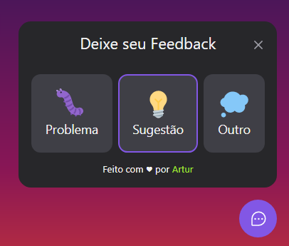
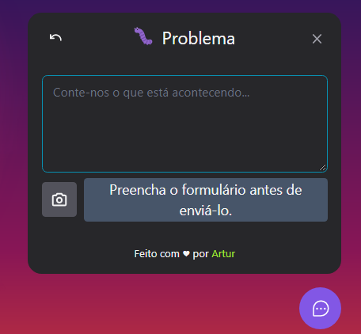
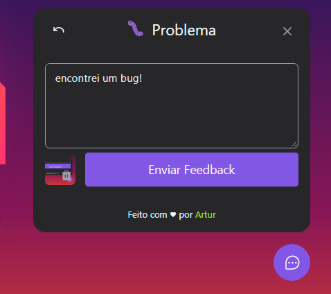
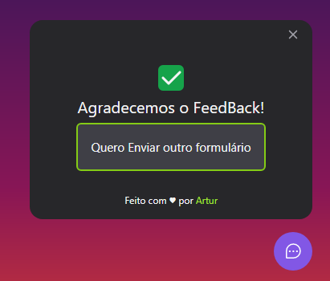
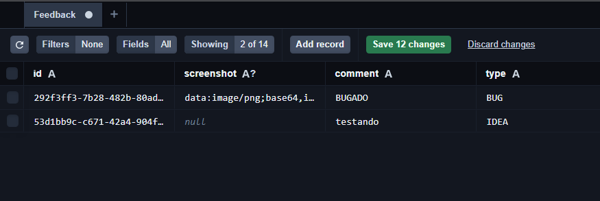
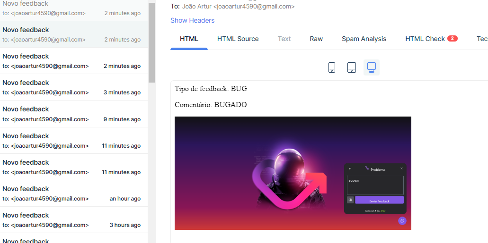

<h1 align="center" > Feedback Widget </h1>

O Projeto é um widget de envio de feedbacks, que possibilita os usuários enviarem suas opiniões e relatar problemas ao navegar em seu site!

Neste projeto o usuário escolhe um tipo de feedback a ser enviado, depois disto, ele adiciona uma descrição ao feedback e opcionalmente uma screenshot da tela atual do site junto com o feedback a ser enviado. Após enviado, o feedback será registrado no banco de dados e será enviado um e-mail ao proprietário da aplicação.

Acesse a aplicação em funcionamento!
Link: [https://feedback-widget-project.vercel.app/](https://feedback-widget-project.vercel.app/)

## Fotos da aplicação:

    <h3>Web APP:</h3>
    
    

        
        
        
        
    

    

     <h3>Server (Database | Email):</h3>
    

        
        
    

## Tecnologias Utilizadas:

✔️ ReactJS
✔️ Typescript
✔️ NodeJS
✔️ Vite
✔️ Express
✔️ Prisma
✔️ TailwindCSS
✔️ Headless UI --> acessibilidade
✔️ html2canvas
✔️ phosphor-react
✔️ nodemailer

## Como Inicializar:

### Iniciar Servidor

- abra o terminal do VsCode na pasta server
- `npm run dev` > inicia o servidor
- `npx prisma studio` > inicia o gerenciador de dados do postgress do prisma
- SQLite:
  - mude o provider `./prisma/schema.prisma` para o "sqlite"
  - `npx prisma migrate dev` > Refaça as migrações no banco de dados, pois elas salvam o tipo de banco de dados (sqlite, postgres, mongo, etc).
- Deploy (Heroku):
  - `npx tsc` > Converte arquivos Typescript para Javascript
  - `npm run start` > Inicia a partir dos arquivos Javascript
  - `npx prisma migrate dev` > faz as migrações no banco de dados
  - Start Command: `npx prisma migrate deploy` > faz as migrations no banco de dados

 

### Iniciar Front-end

- Abra o terminal do VsCode na pasta feedback-widget
- `npm run dev`

 

<h1 align="center">O que aprendi 👨‍💻</h1>
<ul>
    <li>Técnicas de uso dos States para controlar funcionalidades na aplicação (front-end)</li>
    <li>Uso do Tailwind como ferramenta de produtividade, pois ela pode reduzir bastante o tempo necessário para a estilização</li>
    <li>Uso do TypeScript como ferramenta de desenvolvimento</li>
    <li>Uso do Headless UI como ferramenta de desenvolvimento que configura muitas coisas relacionadas à acessibilidade da aplicação.</li>
    <li>Como utilizar o Prisma para aumentar a produtividade e diminuir a probabilidade de erros no desenvolvimento back-end, na parte de criação e conexão com o banco de dados</li>
   
</ul>  

Made with 💜 by João Artur 👋 See my <a href="https://www.linkedin.com/in/magalhesartur/">Linkedin</a>

